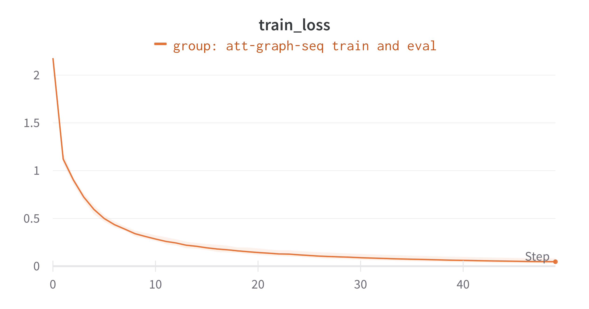
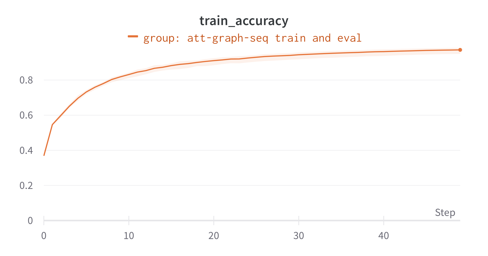
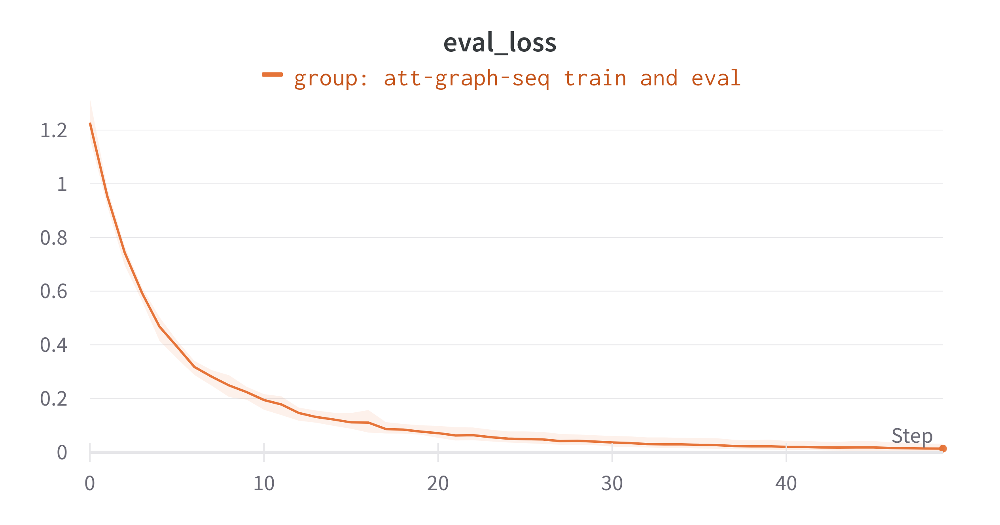
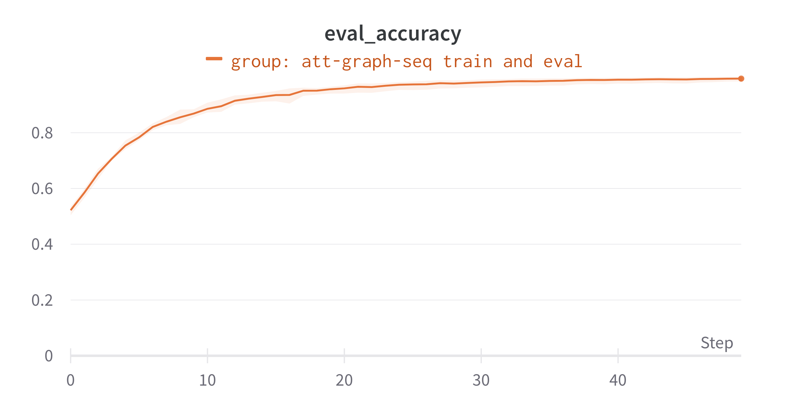
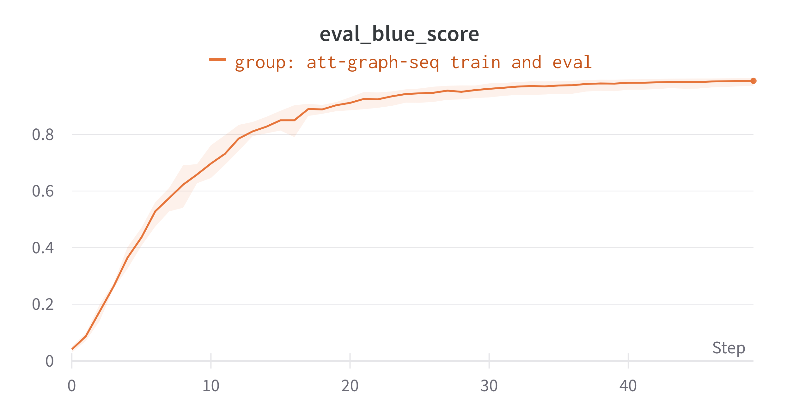

# Graph2Seq: Graph to Sequence Learning with Attention-based Neural Networks

Implementation of Graph2Seq paper in pytorch and PyG

## Project Structure

The project is structured:

 - [main.py](./main.py): The main file for training. It is a pure python file that can receive multiple arguments as inputs to customize the training process. Note that to run the code you need an [wandb](https://wandb.ai/) account.
 - [preprocessing.ipynb](./preprocessing.ipynb): The notebook used to download, unzip and parse the content of the original WikiSQL dataset. The generated output of the notebook is a set of query tokens and graphs later used by [WikiDataset](./src/datapipe/wiki_dataset.py) class to generate the processes in-memory dataset.
 - data: The folder containing the dataset (raw and processed) as well as all the additional pieces of information needed during training and testing.
 - ckps: The folder containing the checkpoints of the model trained. Each model is stored in a subfolder identified by the `experiment_name` that it is associated with..
 - [wiki_dataset.py](src/datapipe/wiki_dataset.py): the InMemoryDataset class implementation for the WikiSQL dataset.
 - [graph_encoder.py](src/models/graph_encoder.py): implementation of the graph-encoder and message-passing modules.
 - [seq_decoder.py](src/models/seq_decoder.py): this file contains the implementation of the sequence decoders. Two decoders are present:
    - DecoderRNN: a simple GRU-based decoder that takes as input the previous token as well as the graph embedding obtained by the graph-polling process
    - AttnDecoderRNN: the attention-based sequence decoder. Instead of using a simple GRU decoder, an attention layer over the node embeddings is applied before the decoding GRU process. Note that, instead of the proposed attention I adopted a simplified version (single head used only for keys and query parameters) of the cross-attention implementation proposed in the `Attention is All you Need` paper. Preliminary experiments showed that adding Layer-Norm and Residual-connections to the attention output is beneficial for the model performances. Due to the limited time, I did not manage to create a separate module for the attention layer.
 - [graph_seq.py](src/models/graph_seq.py): implementation of the simple GraphSeq model and GraphSeqAttn model.
 - [adam.py](src/optim/adam.py): implementation of AdamW.
 - [optimizers.py](src/optim/optimizers.py): utility functions used to setup the optimizer.
 - [schedulers.py](src/optim/schedulers.py): implementation of different schedulers.
 - [training.py](src/utils/training.py): implementation of training and evaluation loops. Note that the training loop is designed to perform `steps_per_epoch` updates, independently from the data loader size. This is hard to handle really large or really small datasets.
 - [common.py](src/utils/common.py): common utility functions.
 - [query.py](src/utils/query.py): common class to parse WikiSQL dataset content.
 - [table.py](src/utils/table.py): common class to parse WikiSQL dataset content.


```
├── ckps
│    ├── {experiment_name}
├── data
│    ├── wiki
│    │    ├── processed
│    │    ├── raw
├── src
│   ├── datapipe
│   │    ├── wiki_dataset.py
│   ├── models
│   │    ├── graph_encoder.py
│   │    ├── graph_seq.py
│   │    ├── seq_decoder.py
│   ├── optim
│   │    ├── adam.py
│   │    ├── optimizers.py
│   │    ├── schedulers.py
│   ├── utils
│   │    ├── training.py
│   │    ├── common.py
│   │    ├── query.py
│   │    ├── table.py
├── main.py
├── preprocessing.ipynb
├── requirements.txt
├── environment.yml
└── .gitignore
```


## Env Setup

For reproducibility, the working environment is shared in 2 different versions:

**1. pip requirements**

this version contains only the packages needed for training

```bash
pip install -r requirements.txt --default-timeout=100
```

*Unfortunately*, torch-scatter and torch-sparse are provided on conda due to their cuda dependencies. Thus you need to manually install 2 additional libraries `torch-scatter` and `torch-sparse`:

```bash
pip install torch-scatter torch-sparse -f https://data.pyg.org/whl/torch-1.13.0+${CUDA}.html
```

where CUDA stand for `cu{verision}`, probably `cu116`.


**2. conda environment**

you can create my working conda environment:

```bash
conda env create -f environment.yml
```

and activate it by `conda activate geometric`.
Note that the conda environment is much larger as it contains jupyter notebook and server.
Thus might require time to install.


##### Why Jupyter Notebooks

I'm not a huge fan of jupyter notebooks as they became large, messy and generate problems when importing multiple times custom code.
Thus, they results difficult to understand or review by other team members.
But, I admit their utility for preprocessing as you can run bash and python commands in the same UI.
Moreover, they are a great tool to visualise data.
To this end, I use a notebook to download, extract and process the WikiSQL dataset in the row format, but the training script is pure python; thus easily deployable for remote execution.

## Results


Fig. 1 and 2 report the training and evaluation performances over 3 distinct runs.
As you can see, the model can consistently achieve accurate predictions on the validation set.

However, the final BLUE-4 score reported on the test set is `0.46` which a half what is reported on the evaluation set. 
This raises concerns about the data processing process and potential differences between the train and test datasets. 

Another visible problem related to the network initialization as the initial training loss is too high suggesting that the network output obtained after random initialising the network is not uniformly distributed across classes.
As a consequence, we might suffer from gradient vanishing problems.


<div style="text-align:center;" id="fig:overfit">
    <figure>
        <figure>
            
            <figcaption style="font-size:small;">
                Figure 1.a: Training loss.
            </figcaption>
        </figure>
        <figure>
            
            <figcaption style="font-size:small;">
                Figure 1.b: Training accuracy.
            </figcaption>
        </figure>
    </figure>
</div>

<div style="text-align:center;" id="fig:overfit">
    <figure>
        <figure>
            
            <figcaption style="font-size:small;">
                Figure 2.a: Eval loss.
            </figcaption>
        </figure>
        <figure>
            
            <figcaption style="font-size:small;">
                Figure 2.b: Eval accuracy.
            </figcaption>
        </figure>
        <figure>
            
            <figcaption style="font-size:small;">
                Figure 2.c: Eval BLUE-4.
            </figcaption>
        </figure>
    </figure>
</div>
